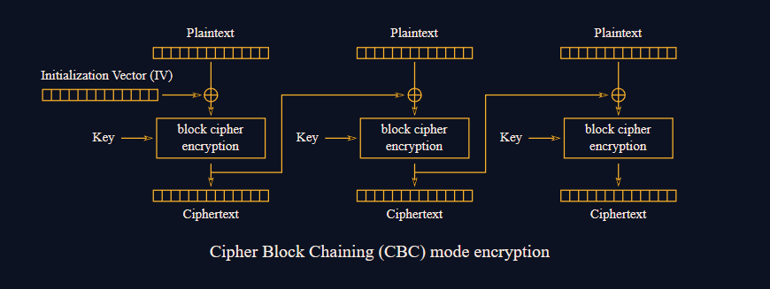
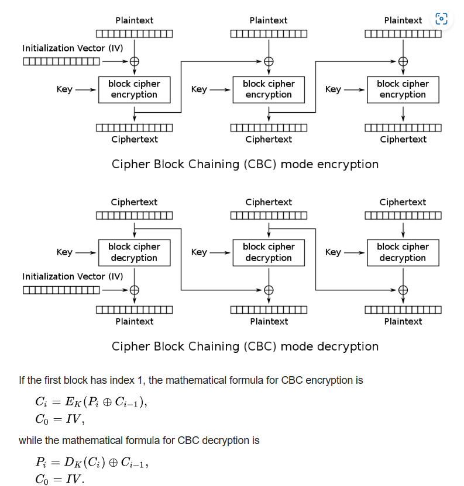
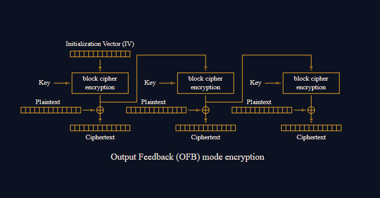
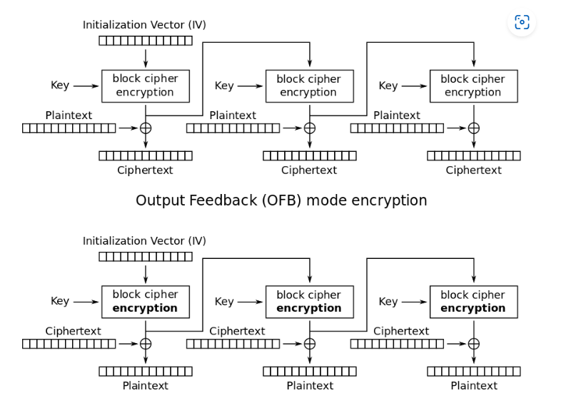
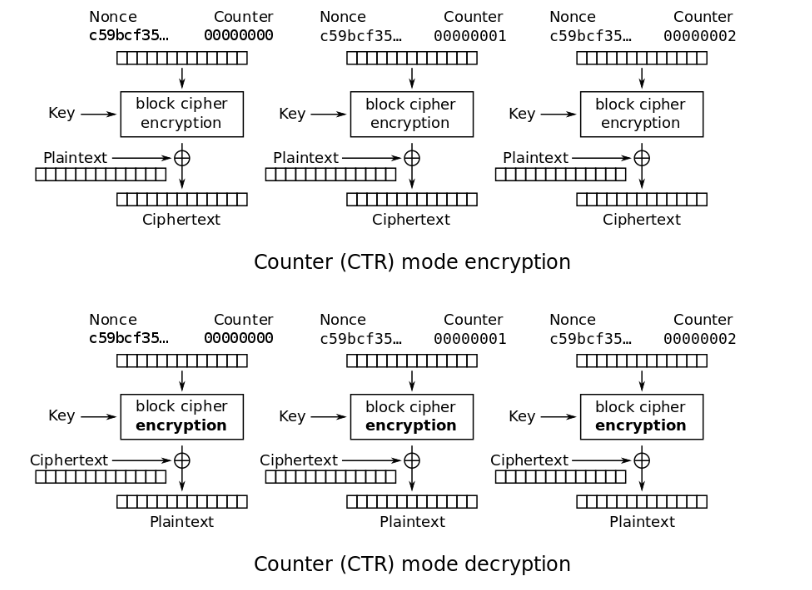

# **AES**

## **Cấu trúc AES**

- Ở cấp độ cao, AES-128 bắt đầu với "lịch trình chính" và sau đó chạy 10 vòng trên một trạng thái. Trạng thái bắt đầu chỉ là khối văn bản gốc mà chúng tôi muốn mã hóa, được biểu diễn dưới dạng ma trận byte 4x4. Trong suốt 10 vòng, trạng thái liên tục được sửa đổi bởi một số phép biến đổi nghịch đảo.

- Dưới đây là tổng quan về các giai đoạn mã hóa AES:


`1. KeyExpansion or Key Schedule`

 From the 128 bit key, 11 separate 128 bit "round keys" are derived: one to be used in each AddRoundKey step.

`2. Initial key addition`

 AddRoundKey - the bytes of the first round key are XOR'd with the bytes of the state.

`3. Round - this phase is looped 10 times, for 9 main rounds plus one "final round"`

  a) SubBytes - each byte of the state is substituted for a different byte according to a lookup table ("S-box").

 b) ShiftRows - the last three rows of the state matrix are transposed—shifted over a column or two or three.

 c) MixColumns - matrix multiplication is performed on the columns of the state, combining the four bytes in each column. This is skipped in the final round.

 d) AddRoundKey - the bytes of the current round key are XOR'd with the bytes of the state.


## **Các chế độ hoạt động AES**

>### **ECB ( Electronic Codebook )**

```python
from Crypto.Cipher import AES

KEY = ?
FLAG = ?

def decrypt(ciphertext):
    ciphertext = bytes.fromhex(ciphertext)
    cipher = AES.new(KEY, AES.MODE_ECB)
    try:
        decrypted = cipher.decrypt(ciphertext)
    except ValueError as e:
        return {"error": str(e)}
    return {"plaintext": decrypted.hex()}

def encrypt_flag():
    cipher = AES.new(KEY, AES.MODE_ECB)
    encrypted = cipher.encrypt(FLAG.encode())
    return {"ciphertext": encrypted.hex()}
```

>### **ECB ORACLE**

```python
from Crypto.Cipher import AES
from Crypto.Util.Padding import pad, unpad


KEY = ?
FLAG = ?

def encrypt(plaintext):
    plaintext = bytes.fromhex(plaintext)

    padded = pad(plaintext + FLAG.encode(), 16)
    cipher = AES.new(KEY, AES.MODE_ECB)
    try:
        encrypted = cipher.encrypt(padded)
    except ValueError as e:
        return {"error": str(e)}

    return {"ciphertext": encrypted.hex()}
```

>### **CBC**



```python

KEY = ?
FLAG = ?
def decrypt(ciphertext):
    ciphertext = bytes.fromhex(ciphertext)

    cipher = AES.new(KEY, AES.MODE_ECB)
    try:
        decrypted = cipher.decrypt(ciphertext)
    except ValueError as e:
        return {"error": str(e)}

    return {"plaintext": decrypted.hex()}

def encrypt_flag():
    iv = os.urandom(16)

    cipher = AES.new(KEY, AES.MODE_CBC, iv)
    encrypted = cipher.encrypt(FLAG.encode())
    ciphertext = iv.hex() + encrypted.hex()

    return {"ciphertext": ciphertext}

```



>### **OFB**





```python
from Crypto.Cipher import AES


KEY = ?
FLAG = ?

def encrypt(plaintext, iv):
    plaintext = bytes.fromhex(plaintext)
    iv = bytes.fromhex(iv)
    if len(iv) != 16:
        return {"error": "IV length must be 16"}

    cipher = AES.new(KEY, AES.MODE_OFB, iv)
    encrypted = cipher.encrypt(plaintext)
    ciphertext = encrypted.hex()

    return {"ciphertext": ciphertext}

def encrypt_flag():
    iv = os.urandom(16)

    cipher = AES.new(KEY, AES.MODE_OFB, iv)
    encrypted = cipher.encrypt(FLAG.encode())
    ciphertext = iv.hex() + encrypted.hex()

    return {"ciphertext": ciphertext}

```

>### **CTR**

```python
from Crypto.Cipher import AES


KEY = ?


class StepUpCounter(object):
    def __init__(self, value=os.urandom(16), step_up=False):
        self.value = value.hex()
        self.step = 1
        self.stup = step_up

    def increment(self):
        if self.stup:
            self.newIV = hex(int(self.value, 16) + self.step)
        else:
            self.newIV = hex(int(self.value, 16) - self.stup)
        self.value = self.newIV[2:len(self.newIV)]
        return bytes.fromhex(self.value.zfill(32))

    def __repr__(self):
        self.increment()
        return self.value


def encrypt():
    cipher = AES.new(KEY, AES.MODE_ECB)
    ctr = StepUpCounter()

    out = []
    with open("challenge_files/bean_flag.png", 'rb') as f:
        block = f.read(16)
        while block:
            keystream = cipher.encrypt(ctr.increment())
            xored = [a^b for a, b in zip(block, keystream)]
            out.append(bytes(xored).hex())
            block = f.read(16)

    return {"encrypted": ''.join(out)}
```


