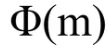

# **TÌM HIỂU VỀ RSA**

## **Tìm hiểu hệ mã hóa công khai**

- `Public key` : Được sử dụng để mã hóa những thông tin mà ta mướn chia sẻ với bất cứ ai. Chính vì vậy ta có thể phân phát nó với bất cứ ai mà ta cần chia sẻ thông tin ở dạng mã hóa.

- `Private key` : Thuộc chủ sở hữu của người mã hóa, nó được sử dụng để giải mã thông tin. Key này dùng để giải mã nên được giữ kín.

> ### **Kiến thức về toán của RSA**

1. **Số nguyên tố ( Prime )**
    - Là số chỉ có ước là 1 và chính nó.
        - ví dụ: 2, 3, 5 ,7, 11, 13, 17, 23
2. **Khái niệm số nguyên tố cùng nhau ( Relatively prime ỏ coprime )**
    - Khi ước chung lớn nhất giữa a và b là 1
        - Ví dụ: GCD(9,10)=1
3. **Khái niệm modulo**

- Với m là một số nguyên dương. Ta nói 2 số nguyên a và b đồng dư với nhau.

- Modulo M nếu M chia hết cho a-b

  - Kí hiệu : `a === b (mod M)`
- `a === b mod(M)` khi và chỉ khi tồn tại số nguyên k sao cho a=b+k*m.

4. **Phi - Hàm EULER**

- Hàm EULER  có giá trị tại n bằng số các số không vượt qua n và nguyên tố cùng nhau với n.

5. **Một số định lý cơ bản**


## **Cách tạo khóa**


- `Khóa công khai:`
  - n
  - e
- `Khóa bí mật:`
  - n
  - d
- Một dạng khác của khóa bí mật bao gồm:
  - p và q
  - d mod (p-1) và d mod (q-1) ( thường được gọi là dmp1 và dmq1)
  - (1/q) mod p (thường được gọi là iqmp)

## **Mã hóa**

- Giả sử có đoạn thông tin M cần gửi. Đầu tiên chuyển M thành một số m < n theo một hàm có thể đảo ngược (từ m có thể xác định lại M) được thỏa thuận trước.

- Lúc này ta có m và biết n cũng như e người nhận. Ta sẽ tính c là bản mã hóa của m theo công thức.

```
c=== m^e mod(n)
```

## **Giải mã**


## **Tính bảo mật**

- Độ an toàn của hệ thống RSA dựa trên 2 vấn đề của toán học: bài toán phân tích ra các thừa số nguyên tố lớn và bài toán RSA. Nếu 2  bài toán trên là khó ko tìm được thuật toán hiệu quả giải chúng thì không thể thực hiện phá vỡ RSA.

## **Tấn công RSA**

- Các đại lượng trong bài toán RSA bao gồm: N, p, q phi, m, c

- Trong đó, N là modulus, được tạo nên từ tích của p và q -> N=p*q.

- p và q là 2 số nguyên tố
- Đại lượng phi = (q-1)(p-1) sao cho gcd(e,phi) = 1
- Khi gcd(e,phi) = 1 thì sẽ tồn tại trong miền phi 1 số d sao cho e*d=1mod(phi), d ở đây là private.

  - Ta có 1 message m , ta sẽ mã hóa message với với e và N theo công thức
  - Ciphertext c = pow(m,e,N)
  - Và giải mã ciphertext c với d và N theo công thức
  - Plaintext m = pow(c,d,N)

- **Ở đây có 2 trường hợp tấn công RSA**
  - Nếu từ N ta có thể phân tích ra được 2 số p và q thì bài toán trở nên cực kì đơn giản, ta có p và q, tìm được phi, ta có e và phi tìm được d, có PribKey(d,N) giải mã ciphertext tìm lại được message.
  - Nếu như không thể phân tích được N , thì ta có thể lợi dụng các gợi ý hoặc các điểm yếu của Pubkey để tìm cách phục hồi message ban đầu và mình sẽ đi vào 1 vài cách tấn công dạng này.

> **Dạng 1: tấn công vào public exponent e**

a, Public exponent rất bé

- Khi e = 3 thì tốc độ mã hóa sẽ khá nhanh, đảm bảo tính nhanh gọn lẹ nhưng về mức độ an toàn thì không cao

> &lt;Hastad’s Broadcast Attack&gt;

- Ví dự ta có 1 message M, được gửi đến 3 nơi khác nhau cùng 1 public exponent e=3 với các Pubkey:

Pubkey1(e,N1) - Pubkey2(e,N2) – Pubkey3(e,N3)

- Lúc đó, ta có:

  - C1 = pow(M,e,N1)
  - C2 = pow(M,e,N2)
  - C3 = pow(M,e,N3)

- Thì ta có thể phục hồi message M ban đầu mà thậm chí không cần quan tâm đến d1, d2, d3.

- Bằng cách sử dụng CRT CRT ( Chinesse Remander Theorem ) ta có thể dễ dàng chứng minh được sẽ tồn tại 1 số C sao cho:  C = pow(M,3,N1*N2*N3)

- Gọi
- T1 = C1*(N2*N3)*invert_modular(N2*N3,N1)
- T2 = C2*(N1*N3)*invert_modular(N1*N3,N2)
- T3 = C3*(N1*N2)*invert_modular(N1*N2,N3)
- Lúc này C = (T1 + T2 + T3) % (N1*N2*N3)
- Vậy C = pow(M,3,N1*N2*N3)
- C = pow(M,3)
- M = pow ( C , 1/3 )
Ta tìm được Message M ban đầu

- Tôi có một đề ra như sau:

```
e = 3 
c1 = 261345950255088824199206969589297492768083568554363001807292202086148198677263604958247638518239089545015544140878441375704999371548235205708718116265184277053405937898051706510050325657424248032017194168466912140157665066494528590260879287464030275170787644749401275343677539640347609231708327119700420050952
n1 = 1001191535967882284769094654562963158339094991366537360172618359025855097846977704928598237040115495676223744383629803332394884046043603063054821999994629411352862317941517957323746992871914047324555019615398720677218748535278252779545622933662625193622517947605928420931496443792865516592262228294965047903627
c2 = 147535246350781145803699087910221608128508531245679654307942476916759248448374688671157343167317710093065456240596223287904483080800880319712443044372346198448258006286828355244986776657425121775659144630571637596283100201930037799979864768887420615134036083295810488407488056595808231221356565664602262179441
n2 = 405864605704280029572517043538873770190562953923346989456102827133294619540434679181357855400199671537151039095796094162418263148474324455458511633891792967156338297585653540910958574924436510557629146762715107527852413979916669819333765187674010542434580990241759130158992365304284892615408513239024879592309 
c3 = 633230627388596886579908367739501184580838393691617645602928172655297372282390454586345936209841638502749645277206386289490247066959822668419069562380546618337543323956757811325946190976649051724173510367477564435069180291575386473277111391106753472257905377429144209593931226163885326581862398737742032667573
n3 = 1204664380009414697639782865058772653140636684336678901863196025928054706723976869222235722439176825580211657044153004521482757717615318907205106770256270292154250168657084197056536811063984234635803887040926920542363612936352393496049379544437329226857538524494283148837536712608224655107228808472106636903723 

```

```python
from Crypto.Util.number import *
from gmpy2 import *

e = 3 
c1 = 261345950255088824199206969589297492768083568554363001807292202086148198677263604958247638518239089545015544140878441375704999371548235205708718116265184277053405937898051706510050325657424248032017194168466912140157665066494528590260879287464030275170787644749401275343677539640347609231708327119700420050952
n1 = 1001191535967882284769094654562963158339094991366537360172618359025855097846977704928598237040115495676223744383629803332394884046043603063054821999994629411352862317941517957323746992871914047324555019615398720677218748535278252779545622933662625193622517947605928420931496443792865516592262228294965047903627
c2 = 147535246350781145803699087910221608128508531245679654307942476916759248448374688671157343167317710093065456240596223287904483080800880319712443044372346198448258006286828355244986776657425121775659144630571637596283100201930037799979864768887420615134036083295810488407488056595808231221356565664602262179441
n2 = 405864605704280029572517043538873770190562953923346989456102827133294619540434679181357855400199671537151039095796094162418263148474324455458511633891792967156338297585653540910958574924436510557629146762715107527852413979916669819333765187674010542434580990241759130158992365304284892615408513239024879592309 
c3 = 633230627388596886579908367739501184580838393691617645602928172655297372282390454586345936209841638502749645277206386289490247066959822668419069562380546618337543323956757811325946190976649051724173510367477564435069180291575386473277111391106753472257905377429144209593931226163885326581862398737742032667573
n3 = 1204664380009414697639782865058772653140636684336678901863196025928054706723976869222235722439176825580211657044153004521482757717615318907205106770256270292154250168657084197056536811063984234635803887040926920542363612936352393496049379544437329226857538524494283148837536712608224655107228808472106636903723 

#Note that: C = pow(M,3,N1*N2*n3)
#Now we're trying to find C = (T1 + T2 + T3) mod (N1*N2*N3)

#T1 = C1*(N2*N3)*invert(N2*N3,N1)
t1 = c1*(n2*n3)*invert(n2*n3,n1)
print "T1 = ",t1

#T2 = C2*(N1*N3)*invert(N1*N3,N2)
t2 = c2*(n1*n3)*invert(n1*n3,n2)
print "T2 = ",t2

#T3 = C3*(N2*N1)*invert(N2*N1,N3)
t3 = c3*(n1*n2)*invert(n1*n2,n3)
print "T3 = ",t3

#Got T1,T2,T3 , Now calculate C 
c = (t1 + t2 + t3) % (n1*n2*n3)
print "C = ",c

#Got C, calculate M
m = str(iroot(c,3)).split('z(')[1].split('L)')[0]
print "M = ",m
print "M in plaintext: ",long_to_bytes(m)
```

> &lt;Coopersmith Attack&gt;

- Ta có:

- Ciphertext C = pow (M,e,N) -> pow(M,e,N)-C =0

- Ví dự M = Hello my name is xxxxxxx

- Ta sẽ gọi với phần biết rồi là m = 'Hello my name is', phần chưa biết là x.
- M= m+x
- Vậy ta có : F(x)= pow(m+x,e,N) - C

- Với biểu thức trên ta có thể tìm được giải pháp tìm toàn bộ message với x < pow(N,1/e). Việc của ta là tìm x sao cho f(x)=0

- Giả sử chúng ta có tin nhắn M = 152575196276689879663724585251481469436742221784430. Nhưng ta chỉ biết e = 5
- N= 104237499678042533743275809982783883924480986889539289797325422594090175106527740057679738592668008651766347497886685933435127297019865963564295049545118142110594144667767717876489190199866996483342002350301254382123057589351031790472347158615662891088346223252828197344147691119599391648412634062556873271467
- e =  5
- C = 4675313024768647763022602752865322642504265647416662809389700983190343798631060177578371154784798189118476506503093551
- Leak =  "Hi im Thao"

- Và giờ ta cần thực hiện tìm x sao cho f(x)= pow(35524181154717197563435087271845310329632+x,e,N) - C =0


> &lt;Tấn công vào Modulus&gt;


```python
from math import gcd

n = 14905562257842714057932724129575002825405393502650869767115942606408600343380327866258982402447992564988466588305174271674657844352454543958847568190372446723549627752274442789184236490768272313187410077124234699854724907039770193680822495470532218905083459730998003622926152590597710213127952141056029516116785229504645179830037937222022291571738973603920664929150436463632305664687903244972880062028301085749434688159905768052041207513149370212313943117665914802379158613359049957688563885391972151218676545972118494969247440489763431359679770422939441710783575668679693678435669541781490217731619224470152467768073
e1 = 12886657667389660800780796462970504910193928992888518978200029826975978624718627799215564700096007849924866627154987365059524315097631111242449314835868137
e2 = 12110586673991788415780355139635579057920926864887110308343229256046868242179445444897790171351302575188607117081580121488253540215781625598048021161675697
c1 = 14010729418703228234352465883041270611113735889838753433295478495763409056136734155612156934673988344882629541204985909650433819205298939877837314145082403528055884752079219150739849992921393509593620449489882380176216648401057401569934043087087362272303101549800941212057354903559653373299153430753882035233354304783275982332995766778499425529570008008029401325668301144188970480975565215953953985078281395545902102245755862663621187438677596628109967066418993851632543137353041712721919291521767262678140115188735994447949166616101182806820741928292882642234238450207472914232596747755261325098225968268926580993051
c2 = 14386997138637978860748278986945098648507142864584111124202580365103793165811666987664851210230009375267398957979494066880296418013345006977654742303441030008490816239306394492168516278328851513359596253775965916326353050138738183351643338294802012193721879700283088378587949921991198231956871429805847767716137817313612304833733918657887480468724409753522369325138502059408241232155633806496752350562284794715321835226991147547651155287812485862794935695241612676255374480132722940682140395725089329445356434489384831036205387293760789976615210310436732813848937666608611803196199865435145094486231635966885932646519

q1 = pow(c1, e2, n)
q2 = pow(c2, e1, n)

d = pow(5, e1 * e2, n) * q1 - pow(2, e1 * e2, n) * q2

q = gcd(d, n)
p = n // q

assert(p * q == n)
```
